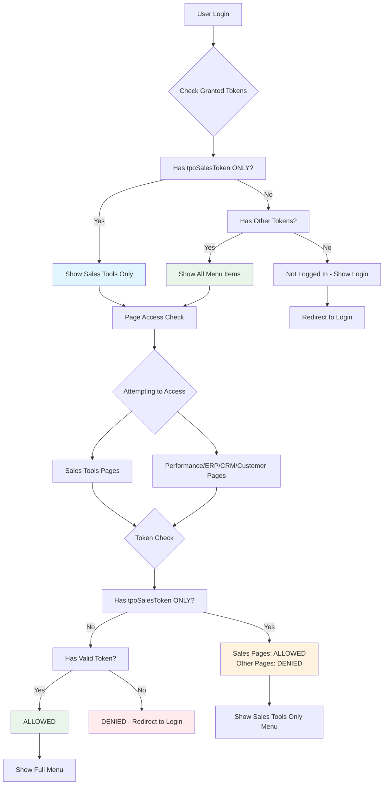

# TPO Token Access Flow Diagram

## Token Hierarchy & Access Control



## Menu Visibility Matrix

| User Token Type | Sales Tools | Performance | ERP | CRM | Customer Portal |
|-----------------|-------------|-------------|-----|-----|-----------------|
| tpoSalesToken ONLY | ✅ Visible | ❌ Hidden | ❌ Hidden | ❌ Hidden | ❌ Hidden |
| tpoEmployeeToken | ✅ Visible | ✅ Visible | ✅ Visible | ✅ Visible | ✅ Visible |
| tpoCRMToken | ✅ Visible | ✅ Visible | ✅ Visible | ✅ Visible | ✅ Visible |
| tpoSalesToken + Other | ✅ Visible | ✅ Visible | ✅ Visible | ✅ Visible | ✅ Visible |
| Not Logged In | ❌ Hidden | ❌ Hidden | ❌ Hidden | ❌ Hidden | ❌ Hidden |

## Page Access Control Matrix

| User Token Type | Sales Tools Pages | Performance Page | ERP Page | CRM Pages | Customer Portal Pages |
|-----------------|------------------|------------------|----------|-----------|----------------------|
| tpoSalesToken ONLY | ✅ Allowed | ❌ Blocked | ❌ Blocked | ❌ Blocked | ❌ Blocked |
| tpoEmployeeToken | ✅ Allowed | ✅ Allowed | ✅ Allowed | ✅ Allowed | ✅ Allowed |
| tpoCRMToken | ✅ Allowed | ✅ Allowed | ✅ Allowed | ✅ Allowed | ✅ Allowed |
| tpoSalesToken + Other | ✅ Allowed | ✅ Allowed | ✅ Allowed | ✅ Allowed | ✅ Allowed |
| Not Logged In | ❌ Redirect to Login | ❌ Redirect to Login | ❌ Redirect to Login | ❌ Redirect to Login | ❌ Redirect to Login |

## Implementation Flow

```mermaid
sequenceDiagram
    participant U as User
    participant L as Login Page
    participant G as Google Apps Script
    participant P as Protected Page
    participant M as Menu System
    
    U->>L: Submit Credentials
    L->>G: Validate & Get Tokens
    G-->>L: Return tpoSalesToken
    L->>L: Store in localStorage
    L->>P: Redirect to Sales-James.html
    
    P->>P: Check localStorage tokens
    P->>M: Update Menu Visibility
    M->>M: Show Sales Tools Only
    M->>P: Menu Updated
    
    Note over P: User tries to access performance.html
    P->>P: Check tokens
    P->>P: tpoSalesToken ONLY detected
    P->>L: Redirect to Login with error
    
    Note over P: User tries to access Sales Tools page
    P->>P: Check tokens
    P->>P: tpoSalesToken valid for Sales Tools
    P->>U: Show Sales Tools page